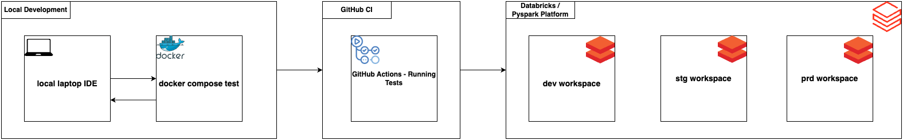

# PySpark Project Template



> Inspiration for this project came from an article I came across on [Developing Production Databricks](https://seattledataguy.substack.com/p/developing-production-databricks) by [Daniel Beach](https://substack.com/@dataengineeringcentral)
> This repository adds delta table support but also approaches this differently.

This repository serves as a **"starter template"** to enable local development for your Databricks projects, eliminating the need to spin up a Databricks cluster each time you develop.

An LLM was used to generate tests to check that PySpark and Delta tables are working as expected. Follow the steps below to get started with this repository.

## Prerequisites

- Python version `>3.11.1`
- Docker
- Docker Compose
- Poetry

## Setup

### Pyenv [Optional]

Installation instructions for pyenv: [https://github.com/pyenv/pyenv](https://github.com/pyenv/pyenv)

```shell
pyenv install 3.11.1
```

### Clone Repository

```shell
git clone https://github.com/zanalytics/pyspark-template.git
cd pyspark-template
```

### Local IDE Setup (Laptop Configuration)

```shell
pyenv local 3.11.1  # [optional]
make install
```

### Running Tests

#### Local Environment

```shell
make test
```

View all available make commands with `make help`.

#### Docker Containerized Tests

Build the Docker image:

```shell
docker build -t pyspark-dev-environment .
```

Run the tests:

```shell
docker compose up test
```

You can add commands you would like to run in the `docker-compose.yml` file.

## Troubleshooting

The files `data/bronze.db`, `data/silver.db`, `data/gold.db`, `derby.log`, and `metastore_db/` can be problematic when switching between running locally and in the container. To resolve this, delete these files using the `clean_databases.sh` script or the following command:

```shell
make refresh-database
```

## Contributing

Contributions to this project are welcome. If you find any issues or have suggestions for improvements, please open an issue or submit a pull request.
